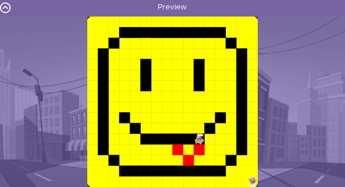

# Unit 1 - Asphalt Art

## Introduction

Cities use asphalt art to improve public safety, inspire their residents and visitors, and brighten communities. Your goal is to create asphalt art to revitalize The Neighborhood and bring the community together with the help of the Painter.

## Requirements

Use your knowledge of object-oriented programming, algorithms, the problem solving process, and decomposition strategies to create asphalt art:
- **Create a new subclass** – Create at least one new subclass of the PainterPlus class that is used for a component of the asphalt art design.
- **Plan an algorithm** – Use the problem solving process and decomposition strategies to plan an algorithm that incorporates a combination of sequencing, selection, and/or iteration.
- **Write a method** – Write at least one method in a PainterPlus subclass that contributes to a component of the asphalt art design.
- **Document your code** – Use comments to explain the purpose of the methods and code segments.

## Notes: Neighborhood & Painter Class

This project was created on Code.org's JavaLab platform using the built in Neightborhood GUI output. To test and edit this project you must build in Code.org's JavaLab with the Neighborhood GUI enabled. For reference to the Painter class documentation, [you can read more here.](https://studio.code.org/docs/ide/javalab/classes/Painter)

## Output:

< Put sketch / Final
image here > 

## Reflection

1. Describe your project.

- My project is a drawing of a smiley face with a tongue sticking out. I used a Mural Painter to paint the background of my project yellow. I also used a Smiley Face Painter to create the outline of the face, the eyes, smile, and tongue. 
  
2. What are two things about your project that you are proud of?

- One thing I am proud of about this project is that I did it all by myself without any one elses help.
- A second thing I am proud of about this project was my ability to understand what I was coding and how to code it. 
  
  3.  Describe something you would improve or do differently if you had an opportunity to change something about your project.

- If I had an oppurtunity to change something about my project I would improve my use of loops. I'm not pretty confident with using loops so if I didn't have to use them I didn't. 
